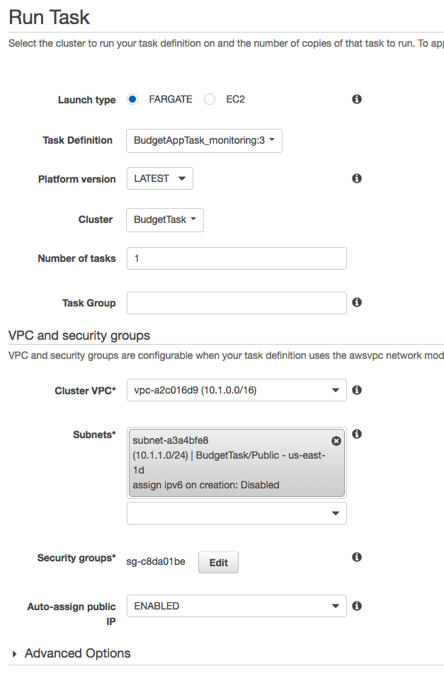

# DevOps instructions

This document will describe Ops how-to.

## Local hosting

It's possible to host BudgetApp locally. Docker image with its running instructions can be found [here](https://budgetapp.docsapp.io/docs/docker).

It was not used during workshop, but might provide free of charge testing environment for users after the workshop.

## Cloud hosting

Deploying BudgetApp in AWS is easily done by Fargate - there is no need to manage underlaying instances, all the infra manangement is automatic.

You would want to access [AWS console](https://kainosmap.signin.aws.amazon.com/console).
In order to do it, notify Agnieszka Tatara or Michal Sierzputowski to get account with privileges for yourself.

After logging in, enter main page and choose N. Virginia region. It is the only region with Fargate available during time of workshops.
In main menu, type `Elastic Container Service` and choose the result that you filtered. In upcoming menu, choose cluster called BudgetTask.

Now, `Task` tab is where we are heading.

Click "Run new task" button.

Fill in details as below.

Please notice security group name, it is important to choose exisiting one with correct name.



Please notice that you can change number of starting tasks. It can vary from 1 to 10 in one go. If you need to setup more than 10 environments, you need to go through "Add new task" form again.

After running the task, you will be taken to main view of cluster insides. After several seconds, you might notice environments status change to "RUNNING" in green colour.
The only thing left is finding public IP address listed in environment details after clicking on environment's ID.

Your fully functional BudgetApp is available under this address and 8080 port.


## Jenkins setup

Jenkins master is available under [here](http://34.237.145.7:8080).

It is accessible from Kainos offices only.


```
u:workshops
p:work123
```


It holds all jobs required to perform the workshop - user load and performance test job.

Jenkins slave per member is created automatically during Task start up.

It automatically registers to master via swarm.

### Messaging attendants

To limit number of manual actions, the script called `find_public_IPs.sh` is available in the repo.
To use it properly, create a text file called `members` in same directory tree as the script and fill it with attendant email address per line with no commas.
You should have access and secret key for your kainosmap profile with us-east-1 region present in your ~/.aws/config file.
After running the script, each member will be emailed with assigned environment IP address and useful details about the course.
